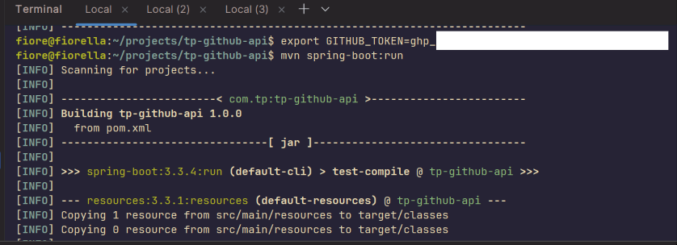
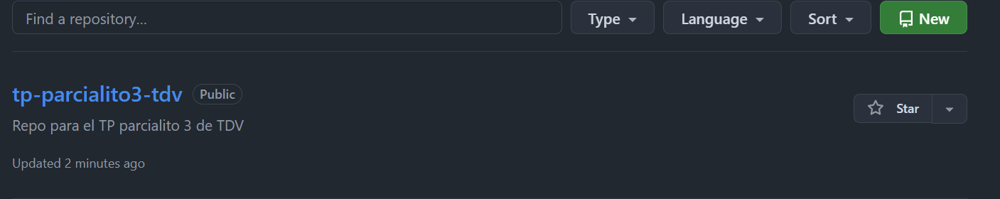
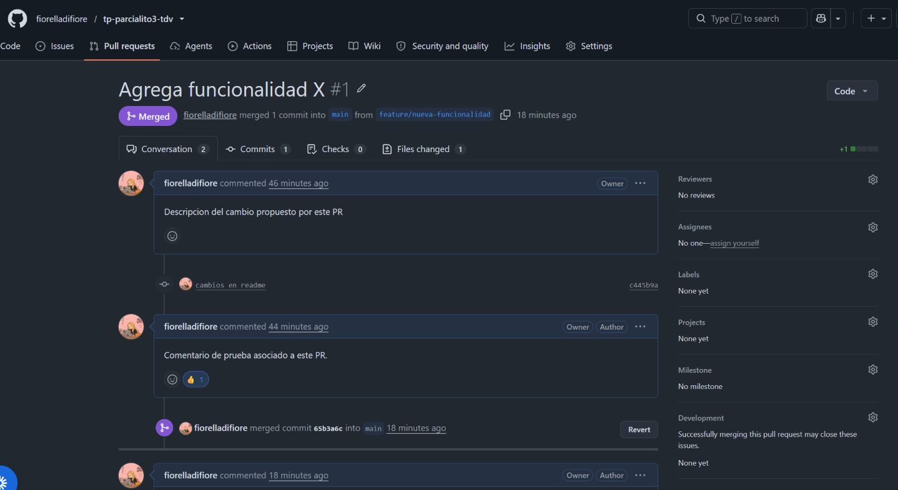
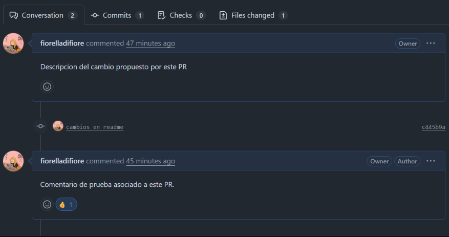
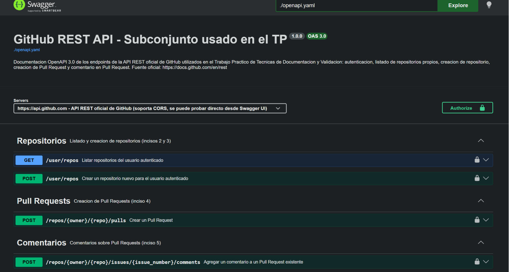
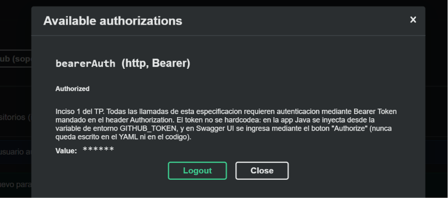

# TP — Técnicas de Documentación y Validación
## Análisis, documentación y automatización de la API REST de GitHub

**Alumno/a:** _Fiorella Di Fiore_
**Fecha:** 2026-07-03

---

## 1. Objetivo

Analizar, documentar y realizar llamadas a la API REST oficial de GitHub
(`https://docs.github.com/en/rest`), cubriendo autenticación, listado y creación de
repositorios, creación de Pull Requests y comentarios sobre PRs. Se documentó el subconjunto
de endpoints utilizados con OpenAPI 3.0, se desplegó esa documentación con Swagger UI, y se
automatizó su validación funcional con Selenium.

## 2. Stack y herramientas utilizadas

| Herramienta | Uso |
|---|---|
| Java 21 + Spring Boot 3.3.4 (Maven) | Cliente HTTP que realiza las llamadas a la API de GitHub |
| Spring `RestClient` | Cliente REST sincrónico, con Bearer token inyectado por configuración |
| OpenAPI 3.0 | Especificación de los endpoints de GitHub utilizados |
| Swagger UI (Docker) | Despliegue local e interactivo de la documentación (`localhost:8081`) |
| Selenium WebDriver + JUnit 5 | Automatización de pruebas funcionales sobre Swagger UI |
| Google Chrome (headless) | Navegador controlado por Selenium |


## 3. Autenticación (inciso 1)

Todas las llamadas usan autenticación **Bearer Token** vía el header `Authorization: Bearer <token>`,
tal como especifica GitHub (https://docs.github.com/en/rest/authentication).

**El token nunca está hardcodeado.** Se inyecta desde la variable de entorno `GITHUB_TOKEN`:

```properties
# application.properties
github.api.token=${GITHUB_TOKEN}
```

```java
// GitHubClientConfig.java
RestClient.builder()
    .baseUrl(properties.baseUrl())
    .defaultHeader(HttpHeaders.AUTHORIZATION, "Bearer " + properties.token())
    ...
```

Si `GITHUB_TOKEN` no está definido, la aplicación falla al arrancar con un mensaje explícito
en vez de intentar llamadas sin autenticar.

__

## 4. Listado de repositorios propios (inciso 2)

**Endpoint:** `GET /user/repos`

**Request:**
```bash
curl -s http://localhost:8080/api/repos
```

**Response (recortada, formato name / visibility / url):**
```json
[
  {"name":"tdv-testing","visibility":"private","html_url":"https://github.com/broxiDev/tdv-testing"},
  {"name":"flashcards","visibility":"private","html_url":"https://github.com/fiorelladifiore/flashcards"},
  {"name":"tp-parcialito3-tdv","visibility":"public","html_url":"https://github.com/fiorelladifiore/tp-parcialito3-tdv"}
]
```
_(ver respuesta completa en el Anexo / logs del proyecto)_

## 5. Creación de un repositorio (inciso 3)

**Endpoint:** `POST /user/repos`

**Request:**
```bash
curl -s -X POST http://localhost:8080/api/repos \
  -H "Content-Type: application/json" \
  -d '{"name":"tp-parcialito3-tdv","description":"Repo para el TP parcialito 3 de TDV","private":false}'
```

**Response:**
```json
{"name":"tp-parcialito3-tdv","visibility":"public","html_url":"https://github.com/fiorelladifiore/tp-parcialito3-tdv"}
```

**Verificación en la web:** https://github.com/fiorelladifiore/tp-parcialito3-tdv

__

## 6. Creación de un Pull Request (inciso 4)

Se creó una rama nueva (`feature/nueva-funcionalidad`) a partir de `main`, con un commit de
prueba, y se abrió el PR entre ambas ramas.

**Endpoint:** `POST /repos/{owner}/{repo}/pulls`

**Request:**
```bash
curl -s -X POST http://localhost:8080/api/repos/fiorelladifiore/tp-parcialito3-tdv/pulls \
  -H "Content-Type: application/json" \
  -d '{"title":"Agrega funcionalidad X","body":"Descripcion del cambio propuesto por este PR","head":"feature/nueva-funcionalidad","base":"main"}'
```

**Response:**
```json
{"number":1,"title":"Agrega funcionalidad X","state":"open","html_url":"https://github.com/fiorelladifiore/tp-parcialito3-tdv/pull/1"}
```

**Verificación en la web:** https://github.com/fiorelladifiore/tp-parcialito3-tdv/pull/1

__

## 7. Comentario en el Pull Request (inciso 5)

**Endpoint:** `POST /repos/{owner}/{repo}/issues/{issue_number}/comments`

> Nota de documentación: en el modelo de datos de GitHub, un Pull Request **es** un Issue con
> capacidades extra (cambios de código asociados). Por eso los comentarios de un PR se agregan
> a través del endpoint de *issues*, usando el mismo número que identifica al PR
> (`issue_number == pull_number`).

**Request:**
```bash
curl -s -X POST http://localhost:8080/api/repos/fiorelladifiore/tp-parcialito3-tdv/pulls/1/comments \
  -H "Content-Type: application/json" \
  -d '{"body":"Comentario de prueba asociado a este PR."}'
```

**Response:**
```json
{"id":4879698742,"body":"Comentario de prueba asociado a este PR.","html_url":"https://github.com/fiorelladifiore/tp-parcialito3-tdv/pull/1#issuecomment-4879698742"}
```

**Verificación:** el comentario queda asociado al PR #1 y visible en
https://github.com/fiorelladifiore/tp-parcialito3-tdv/pull/1#issuecomment-4879698742

__

## 8. Especificación OpenAPI 3.0

Archivo: `openapi/openapi.yaml`. Documenta el subconjunto real de la API de GitHub utilizado
(`servers: https://api.github.com`), no los endpoints propios del wrapper Spring Boot.

Incluye:
- **Esquema de autenticación:** `securitySchemes.bearerAuth` (`type: http`, `scheme: bearer`),
  aplicado globalmente (`security: - bearerAuth: []`).
- **Endpoints documentados:**
  - `GET /user/repos` — listado de repositorios (inciso 2)
  - `POST /user/repos` — creación de repositorio (inciso 3)
  - `POST /repos/{owner}/{repo}/pulls` — creación de PR (inciso 4)
  - `POST /repos/{owner}/{repo}/issues/{issue_number}/comments` — comentario en PR (inciso 5)
- **Parámetros de path:** `owner`, `repo`, `issue_number`.
- **Parámetros de header:** `X-GitHub-Api-Version` (versionado de la API de GitHub).
- **Schemas de request:** `NewRepository`, `NewPullRequest`, `NewComment`.
- **Schemas de response:** `Repository`, `PullRequest`, `Comment`, más `Error` y
  `ValidationErrorBody` para las respuestas 401/403/422.

Validación de la especificación:
```bash
npx @redocly/cli lint openapi/openapi.yaml
```
Resultado: **0 errores**, 1 warning no bloqueante (`info.license` es opcional).

## 9. Despliegue con Swagger UI

Se desplegó localmente con Docker (`docker-compose.yml`), montando `openapi.yaml` dentro de
la imagen oficial `swaggerapi/swagger-ui`:

```bash
docker compose up -d
```

Disponible en `http://localhost:8081`. Como la API de GitHub soporta CORS, Swagger UI puede
ejecutar los requests reales ("Try it out") directamente contra `https://api.github.com` desde
el navegador, sin pasar por la app Spring Boot.

__
__

## 10. Automatización con Selenium

### 10.1 Qué se automatizó

`src/test/java/.../selenium/SwaggerUiSeleniumTest.java` automatiza, contra el Swagger UI local,
los incisos 1, 2 y 3:

1. **Autenticación:** clic en "Authorize", carga del Bearer token (leído de `GITHUB_TOKEN`,
   nunca hardcodeado en el test), confirmación y cierre del modal.
2. **Listado de repositorios:** expande `GET /user/repos`, clic en "Try it out" → "Execute",
   verifica que la respuesta sea `200`.
3. **Creación de repositorio:** expande `POST /user/repos`, completa el body JSON con un nombre
   único (timestamp), ejecuta, verifica que la respuesta sea `201`.

### 10.2 Bug encontrado y corregido durante la validación

Este es el hallazgo más relevante del proceso de validación, y vale la pena documentarlo como
tal:

**Síntoma:** el test pasaba (no tiraba excepción) pero las llamadas devolvían `401 Bad
credentials` con un token **real y válido** (ya verificado por `curl` en los incisos 2 y 3).

**Causa raíz:** el selector original para encontrar el campo del token era genérico:
```java
By.cssSelector("input[type='text']")
```
Cuando se abre el modal de "Authorize", Swagger UI tiene **dos** `input[type="text"]` visibles
al mismo tiempo en el DOM: la barra superior "Explore" (`id="download-url-input"`) y el campo
real del token (`id="auth-bearer-value"`). Selenium toma el primero que encuentra en el DOM —
que es la barra "Explore", no el campo del token — por lo que el token nunca se cargaba, y el
header `Authorization` quedaba vacío en cada request.

**Cómo se detectó:** se interceptaron las requests salientes del navegador (con Playwright, a
modo de instrumento de diagnóstico) durante la ejecución de "Execute", confirmando que el header
`Authorization` llegaba `undefined`.

**Corrección:** apuntar al `id` específico del campo:
```java
WebElement tokenInput = wait.until(
        ExpectedConditions.visibilityOfElementLocated(By.id("auth-bearer-value")));
```

Tras el fix, se repitió la misma instrumentación y se confirmó
`Authorization: Bearer <token>` presente en la request real.

**Lección de validación:** un test que usa un token *inválido* de prueba (como se hizo en una
primera pasada) puede dar un resultado "esperado" (401) incluso si el mecanismo bajo prueba
está roto — un selector equivocado y un token inválido producen el mismo síntoma. La automatización
solo quedó realmente validada al correrla con un token *válido* y confirmar el código `200`/`201`.

### 10.3 Resultado final

```
mvn test -Dtest=SwaggerUiSeleniumTest
...
Tests run: 3, Failures: 0, Errors: 0, Skipped: 0
BUILD SUCCESS
```

## 11. Conclusiones

- Se documentaron y ejecutaron los 5 incisos requeridos contra la API REST oficial de GitHub,
  con autenticación Bearer Token sin credenciales hardcodeadas.
- La especificación OpenAPI 3.0 quedó validada sintácticamente (Redocly) y funcionalmente
  (Swagger UI + Selenium ejecutando llamadas reales).
- El proceso de automatización con Selenium expuso un bug real de selectores que no se
  detecta con pruebas superficiales (usando tokens inválidos), reforzando la importancia de
  validar con datos reales y de instrumentar las pruebas (inspección de requests) en vez de
  confiar solo en el código de resultado esperado.

## Anexo: estructura del proyecto

```
tp-parcialito3-tdv/
├── pom.xml
├── docs
├    └── INFORME.md
├── README.md
├── docker-compose.yml            # Swagger UI local, puerto 8081
├── openapi/openapi.yaml          # OpenAPI 3.0 de los endpoints de GitHub usados
└── src/
    ├── main/java/com/tp/githubapi/
    │   ├── TpGithubApiApplication.java
    │   ├── config/                # RestClient con Bearer token + headers de GitHub
    │   ├── dto/                   # Requests/responses
    │   ├── service/GitHubService.java   # Llamadas reales a api.github.com
    │   ├── controller/GitHubController.java  # Endpoints propios para disparar cada inciso
    │   └── exception/             # Propaga errores reales de GitHub (401, 404, 422...)
    └── test/java/com/tp/githubapi/selenium/
        └── SwaggerUiSeleniumTest.java  # Automatiza incisos 1, 2 y 3 sobre Swagger UI
```
